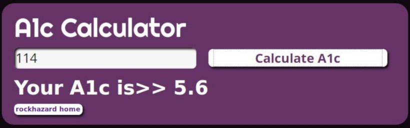

# Ike Davis

---

## Projects

### >> [rwal](https://github.com/rockhazard/rwal/)

Written in Python 3, rwal is a feature-rich cross platform commandline program that turns your desktop background into a flipbook or slide show. Great for rediscovering large image collections.

#### [View Repo](https://github.com/rockhazard/rWall-Stable)

---
### >> [Launch the Spell Point Calculator](https://rockhazard.github.io/spell-point-calculator/)

A utility to assist tracking of spell points when using the variant rules for players in the D&D 5th Edition _Dungeon Master's Guide_ on page 288.

#### [View Repo](https://github.com/rockhazard/spell-point-calculator)

---
### >> [Hemoglobin A1c Calculator](https://rockhazard.github.io/glucose-calculator/)

A utility that converts an average glucose reading given in mg/dL to hemoglobin A1c.

#### [View Repo](https://github.com/rockhazard/glucose-calculator)

---

[Edit Markdown](https://github.com/rockhazard/rockhazard.github.io/edit/master/README.md)
